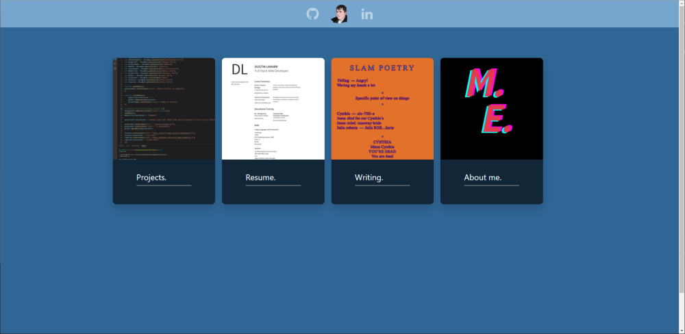

## Portfolio - Dustin LaMarr
This is a constantly updated project to display my developer work to potential employers.

## Motivation
To display my abilities as a developer.

## Build status
Passing

## Code style

 
## Screenshots
</img>

## Tech/framework used
HTML
CSS
Bulma
JavaScript
JQuery
Node.JS

## Features
Cards dedicated to each project. Cards expand to modals with amplifying information and links for each project. 

## Code Example

## Installation
N/A

## API Reference

## Tests
N/A

## How to use?
N/A

## Contribute

## Credits
All me

## License
N/A
